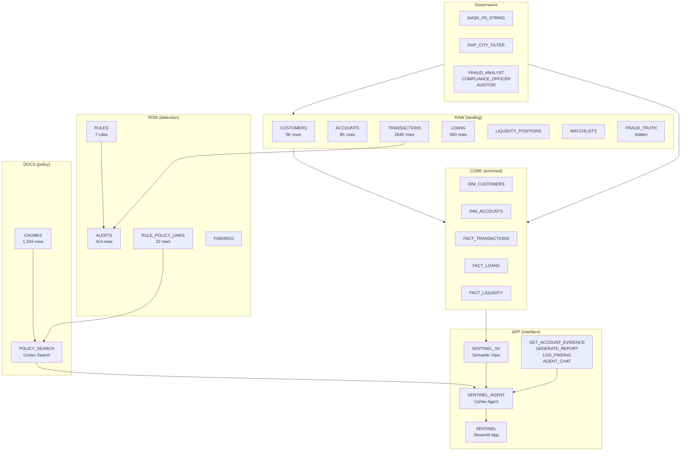

# Sentinel

Banking fraud, AML and regulatory-reporting copilot built entirely on Snowflake using Cortex Code.

> **All data is synthetic.** The 5,000 customers, 8,000 accounts, 284,000 transactions, and 600 loans were generated by a stored procedure with a fixed random seed. Fraud patterns were deliberately planted in ~1-2% of accounts. No real customer or financial data was used. The policy documents are publicly available regulatory publications listed in [`data/policies/SOURCES.md`](data/policies/SOURCES.md).

---

## Problem

Compliance teams in Indian banks and NBFCs manually review thousands of transaction alerts daily, cross-referencing RBI Master Directions, PMLA rules, and FATF recommendations to decide whether activity is suspicious. This is slow, inconsistent, and hard to audit.

Sentinel is a copilot that automates the investigation workflow:
- **Detect** — rule-based alerts with scored severity across 7 fraud/AML patterns
- **Ground** — every flag backed by a specific policy citation (document, page number)
- **Investigate** — full evidence package per account (transactions, alerts, rule hits, citations)
- **Report** — LLM-generated SAR narrative with SQL-computed numbers, validated before output
- **Govern** — role-based access, PII masking, row-level filtering, full audit trail

---

## Architecture



**Data flow:** RAW tables (synthetic data + planted fraud) are enriched into CORE dynamic tables. Seven detection rules scan transactions and produce scored ALERTS. Four public regulatory PDFs are chunked into DOCS.CHUNKS and indexed by a Cortex Search service. The semantic view (7 tables, 12 verified queries) and Cortex Search service are wired into a Cortex Agent alongside three stored procedures. A Streamlit app provides the UI. Masking policies, a row access policy, and three roles enforce least-privilege access.

---

## Setup

### Prerequisites

- Snowflake account with Cortex AI enabled
- Cortex Code CLI (`cortex`) v1.1.87+
- Snowflake CLI (`snow`) v3.14+ (for Streamlit deployment)
- 4 public regulatory PDFs in `data/policies/` (see [`SOURCES.md`](data/policies/SOURCES.md))

### Steps

1. **Infrastructure** — create warehouse, resource monitor, database, 6 schemas:
   ```
   sentinel/sql/00_setup.sql
   ```

2. **Tables + data** — create RAW tables, generate synthetic data with planted fraud patterns:
   ```
   sentinel/sql/01_tables.sql
   sentinel/sql/02_synthetic_data.sql
   ```

3. **Detection pipeline** — CORE dynamic tables, RISK.RULES, alert generation:
   ```
   sentinel/sql/03_pipeline.sql
   ```

4. **Governance** — roles, masking policies, row access policy:
   ```
   sentinel/sql/04_governance.sql
   ```

5. **Policy search** — parse PDFs, load chunks, create Cortex Search service:
   ```
   sentinel/sql/05_docs_search.sql
   ```

6. **Semantic view** — deploy via cortex agent-studio CLI:
   ```
   cortex agent-studio sv-deploy --file-path SENTINEL_SV.sv.yaml
   ```

7. **Agent + procedures** — create stored procedures and Cortex Agent:
   ```
   sentinel/sql/07_tools_agent.sql
   ```

8. **Streamlit app** — deploy to SiS:
   ```bash
   cd sentinel_app
   snow streamlit deploy sentinel --replace
   ```

9. **Reusable skill** — register with CoCo:
   ```bash
   cortex skill add skills/aml-structuring-detector
   ```

---

## How Cortex Code Was Used

The entire system was built through conversational prompts in Cortex Code. Each phase below links to the corresponding evidence screenshots.

### Phase 1: Planning ([evidence/01_planning/](evidence/01_planning/))

CoCo entered plan mode and designed the full architecture from a single prompt: data model (20 tables across 6 schemas), entity-relationship ontology (17 entities), signal-evidence-finding detection workflow, and a 5-phase build plan. Output: 4 markdown design documents totalling 1,700+ lines.

**Key CoCo features used:** `ENTER_PLAN_MODE`, `EXIT_PLAN_MODE`, `WRITE` (4 deliverables)

### Phase 2: Development ([evidence/02_dev_data/](evidence/02_dev_data/))

CoCo created all infrastructure SQL, wrote a 500-line synthetic data generator with Box-Muller log-normal amounts and planted fraud patterns, built CORE dynamic tables, and iteratively fixed data quality issues (CASH-on-MOBILE channel mismatch, transaction realism).

**Key CoCo features used:** `sql_execute` (DDL/DML), stored procedure creation, data validation queries, iterative debugging

### Phase 3: Execution ([evidence/03_exec_detection/](evidence/03_exec_detection/))

CoCo built the detection pipeline (7 rules, 414 alerts), parsed 4 PDFs and loaded 1,334 policy chunks, created the Cortex Search service, linked rules to policy citations, created the semantic view (7 tables, 12 VQRs, tested with 20 NL questions), wired the Cortex Agent (5 tools), deployed the Streamlit app (5 pages), and added governance (3 roles, masking, RAP, audit logging).

**Key CoCo features used:** `cortex agent-studio` (sv-generate, sv-deploy, agent-deploy), `cortex agents run` (testing), `snow streamlit deploy`, `AGENT_CHAT` wrapper procedure, background subagents for parallel test execution

### Phase 4: Testing ([tests/test_questions.csv](../tests/test_questions.csv))

CoCo designed 30 test cases across 8 categories (accuracy, detection, policy citation, report validation, governance, prompt injection, unanswerable, edge cases), executed them via `AGENT_CHAT`, recorded results to `AUDIT.TEST_RESULTS`, identified 3 failures (LCR disambiguation, narrative validation), fixed root causes (agent instructions + LLM prompt), and re-ran to 30/30 pass.

**Key CoCo features used:** `task` tool with background subagent (parallel test execution), `AUDIT.TEST_RESULTS` table, iterative fix-and-rerun loop

---

## Results

### Detection Performance

Validated against `RAW.FRAUD_TRUTH` — synthetic planted fraud patterns with known ground truth.

| Pattern | Planted | Detected | Recall |
|---|---|---|---|
| Structuring | 80 | 80 | 100% |
| Mule Chain | 70 | 70 | 100% |
| Velocity on Dormant | 60 | 60 | 100% |
| Rising DPD | 60 | 60 | 100% |
| Geo Anomaly | 50 | 50 | 100% |
| Round-Tripping | 42 | 42 | 100% |
| Liquidity Stress | 1 | 0 | 0% |
| **Total** | **363** | **362** | **99.7%** |

40 hard-negative accounts were added to stress-test precision. Each rule that detects them (structuring, mule, geo, velocity) gains 10 false positives from these accounts. Round-tripping remains FP-free.

### Agent Evaluation

| Category | Tests | Pass |
|---|---|---|
| Accuracy (analytics) | 6 | 6 |
| Detection (investigation) | 4 | 4 |
| Policy citation | 4 | 4 |
| Report number-validation | 3 | 3 |
| Governance by role | 4 | 4 |
| Prompt injection | 3 | 3 |
| Unanswerable | 3 | 3 |
| Edge cases | 3 | 3 |
| **Total** | **30** | **30/30 (100%)** |

First run: 27/30 (90%). After fixing agent instructions (LCR disambiguation) and LLM prompt (explicit number inclusion), re-run: 30/30 (100%).

### Credits Used

| Service | Credits |
|---|---|
| Warehouse (SENTINEL_WH) | 2.07 |
| AI Services (agent orchestration) | 1.41 |
| Cortex Agents (testing) | 3.99 |
| AI Functions (CORTEX.COMPLETE in reports) | 0.01 |
| SPCS (Streamlit container) | 0.09 |
| **Total (excl. CoCo itself)** | **7.57** |

Resource monitor: 150 credit quota, ~5% consumed.

---

## Reusable Skill

The `aml-structuring-detector` skill packages RULE-001 (cash structuring detection) as a documented, reusable CoCo skill.

**Location:** [`skills/aml-structuring-detector/SKILL.md`](../skills/aml-structuring-detector/SKILL.md)

**What it contains:**
- Configurable thresholds (amount floor/ceiling, min deposits, window days)
- Full detection SQL (sliding-window self-join with scoring)
- Verified regulatory citations (RBI KYC p.22, p.68; FATF p.110)
- Tuning guide for different jurisdictions (INR 10L, USD 10K, EUR 15K)
- 7 documented limitations

**Install:**
```bash
# Local
cortex skill add skills/aml-structuring-detector

# From GitHub
cortex skill add owner/repo --sparse

# From Snowflake stage
cortex skill add @DB.SCHEMA.STAGE/aml-structuring-detector/

# Publish to account catalog
cortex skill publish skills/aml-structuring-detector
```

---

## Limitations

1. **Synthetic data only.** All customers, accounts, and transactions are generated. Planted fraud patterns are simple and predictable. Real-world detection requires tuning against actual data distributions.

2. **Rule-based detection, not ML.** The 7 rules use fixed thresholds and sliding windows. They do not learn from feedback, adapt to evolving patterns, or handle adversarial evasion.

3. **Single-account scope.** Structuring and mule chain detection operate per-account. Cross-account patterns (same beneficial owner splitting across accounts) require entity resolution not implemented here.

4. **Policy corpus is small.** Only 4 public documents (1,334 chunks). A production system would need the full PMLA Act, PML Rules, FATF Mutual Evaluation Reports, internal policies, and regulatory updates.

5. **LLM narrative validation is heuristic.** GENERATE_REPORT checks whether key numbers appear as substrings in the LLM output. This catches obvious hallucinations but not subtle misinterpretations (e.g., confusing inflow with outflow amounts).

6. **Governance is demonstrative.** The row access policy filters by city assignment, and masking covers 7 columns. A production deployment would need field-level encryption, dynamic data masking tied to HR roles, and integration with an IAM provider.

7. **No real-time ingestion.** The pipeline operates on static loaded data. A production system would use Snowpipe Streaming or dynamic tables with short target lag for near-real-time detection.

8. **LIQUIDITY_STRESS recall is 0%.** Only 1 account was planted for this pattern and the detection rule did not fire. The liquidity stress rule needs rework — it currently checks aggregate LCR metrics rather than account-level behaviour.

9. **Hard negatives inflate FP counts.** The 40 hard-negative accounts were deliberately designed to trigger rules. In production, the false-positive rate would depend on the actual data distribution, which may be better or worse.

10. **Cortex Agent is non-deterministic.** The same question may produce slightly different SQL or routing on successive runs. The 30/30 test pass rate reflects a single run — an evaluation dataset with repeated runs would give a more robust accuracy estimate.

---

## Project Structure

```
sentinel/
  README.md                          # This file
  data/policies/                     # 4 regulatory PDFs + SOURCES.md
  docs/                              # Architecture markdown (data model, ontology, workflow, build plan)
  evidence/                          # Screenshots organized by phase + INDEX.md
  sql/                               # All SQL scripts (00-08)
  app/                               # App-related files
  skills/                            # Reusable skills
  tests/                             # Test files
sentinel_app/                        # Streamlit project (deployed to SiS)
cortex_project/                      # Semantic view YAML
skills/aml-structuring-detector/     # Registered CoCo skill
tests/test_questions.csv             # 30 evaluation test cases
```
