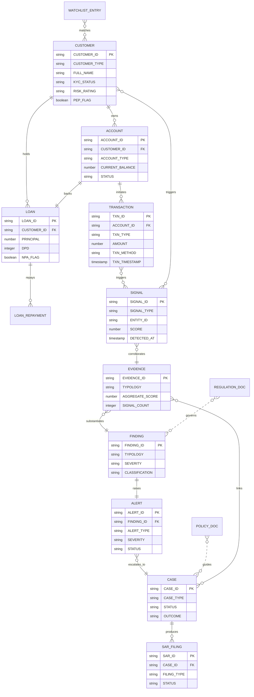

# Sentinel — Ontology

> Entity catalog, relationships, risk taxonomy, and Mermaid ER diagram.

---

## 1 — Entity Catalog

### 1.1 Core Entities

| Entity | Primary Key | Schema | Description |
|--------|-------------|--------|-------------|
| **Customer** | `CUSTOMER_ID` | RAW / CORE | Individual or corporate client. Carries KYC status, risk rating, PEP flag. |
| **Account** | `ACCOUNT_ID` | RAW / CORE | Financial instrument (savings, current, loan, FD, CC). Linked 1:N to Customer. |
| **Transaction** | `TXN_ID` | RAW / CORE | Monetary movement. Enriched with cross-border, high-value, and CTR flags in CORE. |
| **Loan** | `LOAN_ID` | RAW / CORE | Credit facility. Enriched with RBI NPA/SMA classification in CORE. |
| **Loan Repayment** | `REPAYMENT_ID` | RAW | Individual EMI/repayment event against a Loan. |
| **Liquidity Position** | `POSITION_ID` | RAW / CORE | ALM bucket-level inflows, outflows, LCR/NSFR ratios. |
| **Watchlist Entry** | `ENTRY_ID` | RAW | Sanctions/PEP/caution-list record from OFAC, UN, RBI, etc. |

### 1.2 Risk Entities

| Entity | Primary Key | Schema | Description |
|--------|-------------|--------|-------------|
| **Signal** | `SIGNAL_ID` | RISK | Atomic detection from a rule or ML model. Lowest-level risk event. |
| **Evidence** | `EVIDENCE_ID` | RISK | Corroborated cluster of signals within a time window, typed to a typology. |
| **Finding** | `FINDING_ID` | RISK | Adjudicated conclusion: TP/FP/Escalate. Drives alert and case creation. |
| **Alert** | `ALERT_ID` | RISK | Actionable notification surfaced to an analyst. Linked 1:1 to a Finding. |
| **Case** | `CASE_ID` | RISK | Investigation container. Groups evidence, findings, and outcomes. |
| **SAR Filing** | `SAR_ID` | RISK | Suspicious Activity / Transaction Report filed with a regulatory body. |

### 1.3 Knowledge Entities

| Entity | Primary Key | Schema | Description |
|--------|-------------|--------|-------------|
| **Regulation Doc** | `DOC_ID` | DOCS | External regulation text (RBI, FATF, FINCEN circulars). Chunked for RAG. |
| **Policy Doc** | `DOC_ID` | DOCS | Internal compliance/risk policy. Chunked for RAG. |

### 1.4 Audit Entities

| Entity | Primary Key | Schema | Description |
|--------|-------------|--------|-------------|
| **Audit Log** | `LOG_ID` | AUDIT | Immutable event record of every state change in the RISK schema. |
| **Model Decision** | `DECISION_ID` | AUDIT | Explainability record for every ML inference (features, score, SHAP). |

---

## 2 — Relationship Map

| Relationship | From | To | Cardinality | Description |
|-------------|------|-----|-------------|-------------|
| **owns** | Customer | Account | 1 : N | A customer owns one or more accounts |
| **holds** | Customer | Loan | 1 : N | A customer holds zero or more loans |
| **backs** | Account | Loan | 1 : 1 | Each loan is disbursed through an account |
| **initiates** | Account | Transaction | 1 : N | Transactions debit/credit an account |
| **repays** | Loan | Loan Repayment | 1 : N | Each loan has a schedule of repayments |
| **triggers** | Transaction / Customer | Signal | 1 : N | Activity generates raw detection signals |
| **corroborates** | Signal | Evidence | N : 1 | Multiple signals cluster into one evidence record |
| **substantiates** | Evidence | Finding | N : 1 | Evidence items are adjudicated into a finding |
| **raises** | Finding | Alert | 1 : 1 | A confirmed finding creates an alert |
| **escalates_to** | Alert | Case | N : 1 | One or more alerts can be grouped into a case |
| **links** | Case | Evidence | N : N | A case references all supporting evidence (via junction table) |
| **produces** | Case | SAR Filing | 1 : N | A case may result in one or more regulatory filings |
| **governs** | Regulation Doc | Finding / Alert | conceptual | Regulations define the rules that drive detections |
| **guides** | Policy Doc | Case / SAR | conceptual | Policies govern investigation and filing procedures |
| **matches** | Watchlist Entry | Customer | N : N | Watchlist screening matches customers by name/ID |
| **logs** | Any RISK entity | Audit Log | 1 : N | Every state change is recorded immutably |
| **explains** | Signal / Finding | Model Decision | 1 : 1 | ML-driven detections have an explainability record |

---

## 3 — Entity-Relationship Diagram

---

## 4 — Risk-Domain Taxonomy

### 4.1 Fraud Typologies

| Code | Typology | Description | Typical Signals |
|------|----------|-------------|-----------------|
| `F01` | **Structuring (Smurfing)** | Breaking a large transaction into smaller ones to avoid CTR thresholds | Multiple cash deposits just below ₹10 lakh within 24–72 hrs |
| `F02` | **Velocity Abuse** | Abnormal spike in transaction count or value for an account | Txn count > 3σ above 30-day rolling mean |
| `F03` | **Round-Tripping** | Funds leave and return to the same account through intermediaries | Circular flow detected within N hops and T days |
| `F04` | **Ghost / Mule Account** | Account opened with synthetic/stolen identity, used to funnel funds | New account, rapid high-value inflows, immediate outflows |
| `F05` | **Dormant Activation** | Long-dormant account suddenly sees high-value activity | Account idle > 180 days, then > ₹5 lakh in a week |
| `F06` | **Geo-Anomaly** | Transaction origin inconsistent with customer profile | Login from country X, transaction from country Y within minutes |
| `F07` | **Counterfeit Instrument** | Fraudulent cheque, demand draft, or card | Duplicate serial, failed authentication |

### 4.2 AML Typologies

| Code | Typology | Description | Typical Signals |
|------|----------|-------------|-----------------|
| `A01` | **Layering** | Moving illicit funds through multiple accounts/entities to obscure origin | Rapid transfers across 3+ accounts, multiple jurisdictions |
| `A02` | **Smurfing** | Using multiple individuals to conduct transactions below reporting thresholds | Coordinated deposits by different customers to related accounts |
| `A03` | **Trade-Based ML** | Over/under-invoicing goods or services to transfer value across borders | Invoice amount deviates > 40% from market price for the commodity |
| `A04` | **Shell Company** | Routing funds through corporate entities with no real operations | High turnover, no employees, registered-agent address |
| `A05` | **Hawala / Informal VTS** | Value transfer without actual money movement (settled informally) | Matching debit in jurisdiction A, credit in jurisdiction B, no wire |
| `A06` | **Politically Exposed** | Transactions by or connected to PEP individuals | Watchlist hit + high-value transactions |

### 4.3 Regulatory / Compliance Typologies

| Code | Typology | Description |
|------|----------|-------------|
| `R01` | **CTR Breach** | Cash transaction ≥ ₹10 lakh not reported within deadline |
| `R02` | **KYC Overdue** | Customer KYC not refreshed within the mandated cycle (2 yrs / 5 yrs / 10 yrs based on risk) |
| `R03` | **NPA Early Warning** | Loan enters SMA-1/SMA-2 bracket, RBI early-warning signal |
| `R04` | **Liquidity Breach** | LCR < 100% or NSFR < 100% |
| `R05` | **Cross-Border Threshold** | Outward remittance > USD 250K in a financial year (LRS limit) |

---

## 5 — Classification Tags

Every entity in the ontology carries these classification dimensions:

| Dimension | Values | Used By |
|-----------|--------|---------|
| `ENTITY_TYPE` | CUSTOMER, ACCOUNT, TRANSACTION, LOAN | All RISK tables |
| `SEVERITY` | LOW, MEDIUM, HIGH, CRITICAL | Signals, Evidence, Findings, Alerts |
| `TYPOLOGY` | F01–F07, A01–A06, R01–R05 (see above) | Evidence, Findings |
| `CLASSIFICATION` | TRUE_POSITIVE, FALSE_POSITIVE, ESCALATE, UNDER_REVIEW | Findings |
| `STATUS` (lifecycle) | OPEN → INVESTIGATING → ESCALATED → CLOSED_TP / CLOSED_FP | Alerts, Cases |
| `KYC_STATUS` | PENDING, VERIFIED, EXPIRED, REJECTED | Customers |
| `RISK_RATING` | LOW, MEDIUM, HIGH, PEP, SANCTIONED | Customers |
| `ASSET_CLASSIFICATION` | STANDARD, SMA, NPA_SUBSTANDARD, NPA_DOUBTFUL, NPA_LOSS | Loans |
