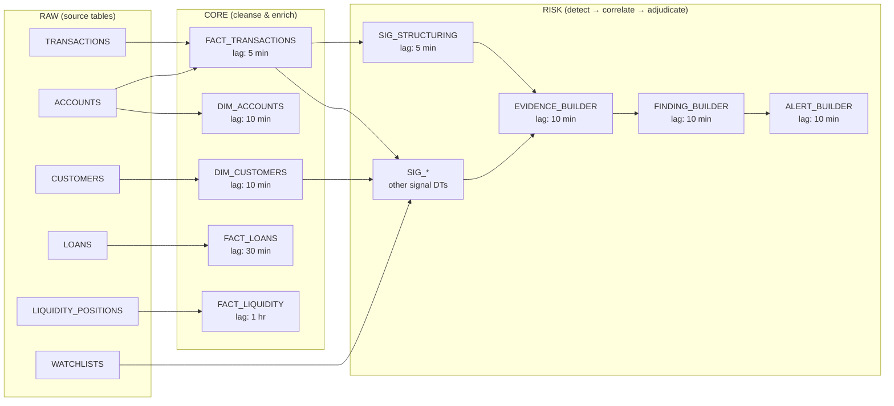
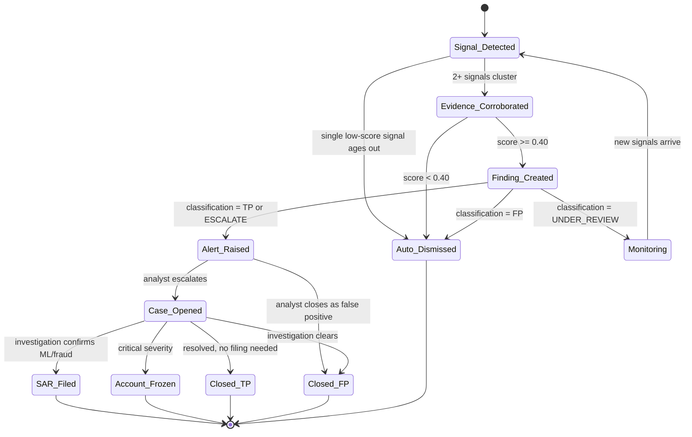

# Sentinel — Signal → Evidence → Finding Workflow

> The three-tier detection pipeline that turns raw activity into actionable
> risk findings, powered by Snowflake Dynamic Tables.

---

## 1 — Overview

```
┌─────────┐     ┌──────────┐     ┌──────────┐     ┌──────────┐     ┌──────────┐
│  RAW.*  │────▶│  CORE.*  │────▶│  RISK.   │────▶│  RISK.   │────▶│  RISK.   │
│ (ingest)│     │  (DTs)   │     │ SIGNALS  │     │ EVIDENCE │     │ FINDINGS │
└─────────┘     └──────────┘     └──────────┘     └──────────┘     └──────────┘
                                      │                │                │
                                      │                │                ▼
                                      │                │          ┌──────────┐
                                      │                │          │  RISK.   │
                                      │                │          │ ALERTS   │
                                      │                │          └────┬─────┘
                                      │                │               │
                                      │                │               ▼
                                      │                │          ┌──────────┐
                                      ▼                ▼          │  RISK.   │
                                 AUDIT.MODEL      AUDIT.AUDIT     │  CASES   │
                                 _DECISIONS       _LOG            └────┬─────┘
                                                                      │
                                                                      ▼
                                                                 ┌──────────┐
                                                                 │  RISK.   │
                                                                 │SAR_FILINGS│
                                                                 └──────────┘
```

---

## 2 — Layer 1: Signals (Detection)

### What is a Signal?

A **signal** is the smallest unit of suspicion — a single rule match or ML score
that flags an atomic event or entity for review. Signals are cheap, high-volume,
and deliberately noisy (high recall, lower precision).

### Signal Sources

| Source | Method | Example |
|--------|--------|---------|
| **Rule Engine** | SQL-based threshold/pattern rules | `AMOUNT >= 1000000 AND TXN_METHOD = 'CASH'` → CTR_THRESHOLD |
| **ML Scoring** | Cortex ML or external model inference | Anomaly score > 0.85 → VELOCITY_SPIKE |
| **Watchlist Screening** | Fuzzy name match against WATCHLISTS | Jaro-Winkler > 0.92 → WATCHLIST_HIT |
| **Peer-Group Deviation** | Statistical comparison to cohort | Txn volume > 3σ vs same-segment customers |

### Signal Generation (Dynamic Table)

```sql
-- Example: Structuring detection (multiple sub-threshold cash deposits)
CREATE OR REPLACE DYNAMIC TABLE SENTINEL_DB.RISK.SIG_STRUCTURING
    TARGET_LAG = '5 minutes'
    WAREHOUSE  = SENTINEL_WH
AS
WITH cash_deposits AS (
    SELECT
        ft.CUSTOMER_ID,
        ft.ACCOUNT_ID,
        ft.TXN_DATE,
        COUNT(*)                                    AS TXN_COUNT,
        SUM(ft.AMOUNT)                              AS TOTAL_AMOUNT,
        MAX(ft.AMOUNT)                              AS MAX_SINGLE,
        ARRAY_AGG(ft.TXN_ID) WITHIN GROUP (ORDER BY ft.TXN_TIMESTAMP) AS TXN_IDS
    FROM SENTINEL_DB.CORE.FACT_TRANSACTIONS ft
    WHERE ft.TXN_METHOD = 'CASH'
      AND ft.TXN_TYPE   = 'CREDIT'
      AND ft.STATUS      = 'COMPLETED'
    GROUP BY ft.CUSTOMER_ID, ft.ACCOUNT_ID, ft.TXN_DATE
)
SELECT
    UUID_STRING()           AS SIGNAL_ID,
    'STRUCTURING'           AS SIGNAL_TYPE,
    'CUSTOMER'              AS ENTITY_TYPE,
    cd.CUSTOMER_ID          AS ENTITY_ID,
    NULL                    AS TXN_ID,
    'RULE_STRUCTURING_V1'   AS RULE_ID,
    NULL                    AS ML_MODEL_ID,
    -- score: higher when more txns cluster just below threshold
    LEAST(1.0, (cd.TXN_COUNT * 0.15) + (cd.TOTAL_AMOUNT / 1000000 * 0.3))::NUMBER(5,4) AS SCORE,
    OBJECT_CONSTRUCT(
        'txn_count',    cd.TXN_COUNT,
        'total_amount', cd.TOTAL_AMOUNT,
        'max_single',   cd.MAX_SINGLE,
        'txn_ids',      cd.TXN_IDS,
        'date',         cd.TXN_DATE
    )                       AS DETAILS,
    CURRENT_TIMESTAMP()     AS DETECTED_AT
FROM cash_deposits cd
WHERE cd.TXN_COUNT   >= 3            -- 3+ cash deposits in one day
  AND cd.TOTAL_AMOUNT >= 800000       -- combined total approaches ₹10 lakh
  AND cd.MAX_SINGLE   <  1000000;    -- no single txn hits the CTR threshold
```

### Signal Types (complete list)

| Signal Type | Trigger | Typical Score Range |
|------------|---------|---------------------|
| `VELOCITY_SPIKE` | Txn count > 3σ in rolling window | 0.70 – 0.95 |
| `HIGH_VALUE_CASH` | Single cash txn ≥ ₹10 lakh | 1.00 (deterministic) |
| `STRUCTURING` | Multiple sub-threshold cash deposits | 0.50 – 0.90 |
| `WATCHLIST_HIT` | Name/ID match on sanctions list | 0.80 – 1.00 |
| `ROUND_TRIP` | Circular fund flow within N hops | 0.60 – 0.95 |
| `DORMANT_ACTIVATION` | Idle > 180 days + sudden high activity | 0.65 – 0.85 |
| `GEO_ANOMALY` | Impossible travel or jurisdiction mismatch | 0.55 – 0.90 |
| `RAPID_FUND_THROUGH` | Funds in and out within minutes/hours | 0.70 – 0.95 |
| `CTR_THRESHOLD` | Cash ≥ ₹10 lakh (regulatory, auto-report) | 1.00 |
| `UNUSUAL_COUNTERPARTY` | First-time counterparty + high value | 0.40 – 0.75 |

---

## 3 — Layer 2: Evidence (Corroboration)

### What is Evidence?

**Evidence** groups related signals by entity and time window, enriches them
with contextual data (peer-group stats, network analysis, customer history),
and assigns a typology label. Evidence separates coincidence from pattern.

### Corroboration Rules

| Rule | Logic |
|------|-------|
| **Time-window clustering** | Group signals for the same `ENTITY_ID` within a rolling 72-hour window |
| **Multi-signal reinforcement** | 2+ different `SIGNAL_TYPE` values for the same entity → higher aggregate score |
| **Peer-group deviation** | Compare entity metrics to cohort (same segment, geography, account age) |
| **Network expansion** | If entity A is flagged, check 1-hop counterparties for correlated signals |
| **Watchlist enrichment** | If a WATCHLIST_HIT signal exists, auto-escalate aggregate score by +0.20 |

### Evidence Generation (Dynamic Table)

```sql
CREATE OR REPLACE DYNAMIC TABLE SENTINEL_DB.RISK.EVIDENCE_BUILDER
    TARGET_LAG = '10 minutes'
    WAREHOUSE  = SENTINEL_WH
AS
WITH signal_windows AS (
    SELECT
        s.ENTITY_TYPE,
        s.ENTITY_ID,
        -- 72-hour tumbling window aligned to midnight
        DATE_TRUNC('day', s.DETECTED_AT)                        AS WINDOW_START,
        DATEADD('hour', 72, DATE_TRUNC('day', s.DETECTED_AT))  AS WINDOW_END,
        COUNT(*)                                                 AS SIGNAL_COUNT,
        COUNT(DISTINCT s.SIGNAL_TYPE)                            AS DISTINCT_TYPES,
        ARRAY_AGG(s.SIGNAL_ID)                                   AS SIGNAL_IDS,
        AVG(s.SCORE)                                             AS AVG_SCORE,
        MAX(s.SCORE)                                             AS MAX_SCORE,
        LISTAGG(DISTINCT s.SIGNAL_TYPE, ', ')                    AS SIGNAL_TYPES_CSV,
        MAX(CASE WHEN s.SIGNAL_TYPE = 'WATCHLIST_HIT' THEN 1 ELSE 0 END) AS HAS_WATCHLIST_HIT
    FROM SENTINEL_DB.RISK.SIGNALS s
    GROUP BY s.ENTITY_TYPE, s.ENTITY_ID, DATE_TRUNC('day', s.DETECTED_AT)
    HAVING COUNT(*) >= 2  -- at least 2 signals to form evidence
)
SELECT
    UUID_STRING()           AS EVIDENCE_ID,
    sw.ENTITY_TYPE,
    sw.ENTITY_ID,
    sw.WINDOW_START         AS EVIDENCE_WINDOW_START,
    sw.WINDOW_END           AS EVIDENCE_WINDOW_END,
    sw.SIGNAL_COUNT,
    sw.SIGNAL_IDS,
    -- typology classification
    CASE
        WHEN sw.SIGNAL_TYPES_CSV ILIKE '%STRUCTURING%'       THEN 'STRUCTURING'
        WHEN sw.SIGNAL_TYPES_CSV ILIKE '%ROUND_TRIP%'        THEN 'ROUND_TRIPPING'
        WHEN sw.SIGNAL_TYPES_CSV ILIKE '%RAPID_FUND_THROUGH%'
         AND sw.SIGNAL_TYPES_CSV ILIKE '%VELOCITY%'          THEN 'LAYERING'
        WHEN sw.SIGNAL_TYPES_CSV ILIKE '%WATCHLIST_HIT%'     THEN 'SANCTIONS_EXPOSURE'
        WHEN sw.SIGNAL_TYPES_CSV ILIKE '%DORMANT%'           THEN 'GHOST_ACCOUNT'
        WHEN sw.SIGNAL_TYPES_CSV ILIKE '%GEO_ANOMALY%'       THEN 'GEO_FRAUD'
        ELSE 'MULTI_SIGNAL_CLUSTER'
    END                     AS TYPOLOGY,
    -- aggregate score with reinforcement bonuses
    LEAST(1.0, (
        sw.AVG_SCORE
        + (sw.DISTINCT_TYPES - 1) * 0.10   -- multi-type bonus
        + sw.HAS_WATCHLIST_HIT    * 0.20    -- watchlist escalation
    ))::NUMBER(5,4)         AS AGGREGATE_SCORE,
    OBJECT_CONSTRUCT(
        'signal_types',     sw.SIGNAL_TYPES_CSV,
        'distinct_types',   sw.DISTINCT_TYPES,
        'avg_score',        sw.AVG_SCORE,
        'max_score',        sw.MAX_SCORE,
        'watchlist_boost',  sw.HAS_WATCHLIST_HIT
    )                       AS CONTEXT,
    CURRENT_TIMESTAMP()     AS CORROBORATED_AT
FROM signal_windows sw;
```

---

## 4 — Layer 3: Findings (Adjudication)

### What is a Finding?

A **finding** is a human-or-AI adjudicated conclusion drawn from one or more
evidence records. It answers: "Is this suspicious activity real, and what
should we do about it?"

### Adjudication Logic

| Score Range | Auto-Classification | Recommended Action |
|-------------|---------------------|--------------------|
| 0.00 – 0.39 | FALSE_POSITIVE | DISMISS |
| 0.40 – 0.59 | UNDER_REVIEW | MONITOR |
| 0.60 – 0.79 | ESCALATE | ALERT (assign to analyst) |
| 0.80 – 0.89 | TRUE_POSITIVE | FILE_SAR |
| 0.90 – 1.00 | TRUE_POSITIVE | FREEZE_ACCOUNT + FILE_SAR |

### Finding Generation (Dynamic Table)

```sql
CREATE OR REPLACE DYNAMIC TABLE SENTINEL_DB.RISK.FINDING_BUILDER
    TARGET_LAG = '10 minutes'
    WAREHOUSE  = SENTINEL_WH
AS
SELECT
    UUID_STRING()           AS FINDING_ID,
    e.ENTITY_TYPE,
    e.ENTITY_ID,
    ARRAY_CONSTRUCT(e.EVIDENCE_ID) AS EVIDENCE_IDS,
    e.TYPOLOGY,
    -- severity
    CASE
        WHEN e.AGGREGATE_SCORE >= 0.90 THEN 'CRITICAL'
        WHEN e.AGGREGATE_SCORE >= 0.70 THEN 'HIGH'
        WHEN e.AGGREGATE_SCORE >= 0.50 THEN 'MEDIUM'
        ELSE 'LOW'
    END                     AS SEVERITY,
    -- classification
    CASE
        WHEN e.AGGREGATE_SCORE >= 0.80 THEN 'TRUE_POSITIVE'
        WHEN e.AGGREGATE_SCORE >= 0.60 THEN 'ESCALATE'
        WHEN e.AGGREGATE_SCORE >= 0.40 THEN 'UNDER_REVIEW'
        ELSE 'FALSE_POSITIVE'
    END                     AS CLASSIFICATION,
    -- narrative placeholder (populated by Cortex AI_COMPLETE in production)
    'Auto-generated finding for ' || e.TYPOLOGY || ' activity on entity '
        || e.ENTITY_ID || '. Aggregate score: ' || e.AGGREGATE_SCORE
        || '. Signal count: ' || e.SIGNAL_COUNT || '.'
                            AS NARRATIVE,
    -- recommended action
    CASE
        WHEN e.AGGREGATE_SCORE >= 0.90 THEN 'FREEZE_ACCOUNT'
        WHEN e.AGGREGATE_SCORE >= 0.80 THEN 'FILE_SAR'
        WHEN e.AGGREGATE_SCORE >= 0.60 THEN 'ALERT'
        WHEN e.AGGREGATE_SCORE >= 0.40 THEN 'MONITOR'
        ELSE 'DISMISS'
    END                     AS RECOMMENDED_ACTION,
    CURRENT_TIMESTAMP()     AS ADJUDICATED_AT,
    'SYSTEM'                AS ADJUDICATED_BY
FROM SENTINEL_DB.RISK.EVIDENCE_BUILDER e
WHERE e.AGGREGATE_SCORE >= 0.40;  -- below 0.40 is auto-dismissed, not persisted as finding
```

### Alert Auto-Generation (Dynamic Table)

```sql
CREATE OR REPLACE DYNAMIC TABLE SENTINEL_DB.RISK.ALERT_BUILDER
    TARGET_LAG = '10 minutes'
    WAREHOUSE  = SENTINEL_WH
AS
SELECT
    UUID_STRING()           AS ALERT_ID,
    f.FINDING_ID,
    f.ENTITY_TYPE,
    f.ENTITY_ID,
    -- map typology to alert type
    CASE
        WHEN f.TYPOLOGY IN ('STRUCTURING','LAYERING','ROUND_TRIPPING','GHOST_ACCOUNT')
            THEN 'AML_STR'
        WHEN f.TYPOLOGY = 'SANCTIONS_EXPOSURE'
            THEN 'AML_STR'
        WHEN f.TYPOLOGY IN ('GEO_FRAUD','VELOCITY_ABUSE')
            THEN 'FRAUD_SUSPECTED'
        ELSE 'AML_STR'
    END                     AS ALERT_TYPE,
    f.SEVERITY,
    'OPEN'                  AS STATUS,
    NULL                    AS ASSIGNED_TO,
    CURRENT_TIMESTAMP()     AS CREATED_AT,
    CURRENT_TIMESTAMP()     AS UPDATED_AT,
    NULL                    AS CLOSED_AT,
    -- SLA: CRITICAL = 4 hrs, HIGH = 24 hrs, MEDIUM = 72 hrs
    CASE
        WHEN f.SEVERITY = 'CRITICAL' THEN DATEADD('hour', 4, CURRENT_TIMESTAMP())
        WHEN f.SEVERITY = 'HIGH'     THEN DATEADD('hour', 24, CURRENT_TIMESTAMP())
        ELSE DATEADD('hour', 72, CURRENT_TIMESTAMP())
    END                     AS SLA_DUE_AT
FROM SENTINEL_DB.RISK.FINDING_BUILDER f
WHERE f.CLASSIFICATION IN ('TRUE_POSITIVE', 'ESCALATE');
```

---

## 5 — Dynamic Table DAG

The entire pipeline is expressed as a directed acyclic graph of Dynamic Tables.
Snowflake manages refresh order and incrementality automatically.



### Target Lag Summary

| Layer | Dynamic Table | Target Lag | Rationale |
|-------|--------------|------------|-----------|
| CORE | DIM_CUSTOMERS | 10 min | Customer data changes infrequently |
| CORE | DIM_ACCOUNTS | 10 min | Account balance updates in near-real-time |
| CORE | FACT_TRANSACTIONS | 5 min | Transactions are the primary signal source |
| CORE | FACT_LOANS | 30 min | Loan status changes daily (DPD, NPA) |
| CORE | FACT_LIQUIDITY | 1 hour | ALM positions reported end-of-day |
| RISK | SIG_* (all signal DTs) | 5 min | Detection should be near-real-time |
| RISK | EVIDENCE_BUILDER | 10 min | Corroboration can lag slightly behind signals |
| RISK | FINDING_BUILDER | 10 min | Adjudication follows evidence |
| RISK | ALERT_BUILDER | 10 min | Alerts must surface within ~30 min of raw event |

**End-to-end latency (worst case):** 5 + 5 + 10 + 10 + 10 = **40 minutes** from transaction ingestion to alert.

---

## 6 — Workflow State Machine



---

## 7 — AI Enrichment Points

| Stage | Cortex Function | Purpose |
|-------|----------------|---------|
| Signal | `AI_COMPLETE` | Score transactions using LLM-based anomaly reasoning |
| Signal | `AI_CLASSIFY` | Classify remittance text into risk categories |
| Evidence | `AI_COMPLETE` | Generate evidence narrative summarizing signal cluster |
| Finding | `AI_COMPLETE` | Draft investigation narrative for analyst review |
| Finding | `AI_EXTRACT` | Extract key entities (names, amounts, dates) from narratives |
| SAR Filing | `AI_COMPLETE` | Draft SAR narrative per FIU-IND / FinCEN template |
| Knowledge | `CORTEX_SEARCH` | RAG over regulation & policy docs for compliance guidance |
